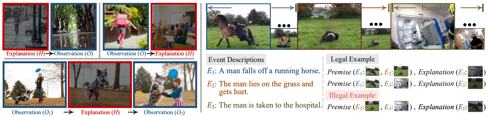

# Visual Abductive Reasoning

<div align="center">
  
</div>

> This repository is an official PyTorch implementation of paper:<br>
> [Visual Abductive Reasoning](https://arxiv.org/abs/2203.14040).<br>
> [Chen Liang](https://leonnnop.github.io/), [Wenguan Wang](https://sites.google.com/view/wenguanwang/), [Tianfei Zhou](https://www.tfzhou.com/), [Yi Yang](https://scholar.google.com/citations?user=RMSuNFwAAAAJ&hl=zh-CN) <br>
> CVPR 2022.


## News & Update Logs:
- [x] [2022-03-25] Repo created. Paper, code, and data will come in a few days. Stay tuned.
- [x] [2022-03-26] VAR dataset v1.0 released; Evaluation toolkit uploaded.
- [x] [2022-04-07] Full paper available at [arXiv](https://arxiv.org/abs/2203.14040).


## Abstract

Abductive reasoning seeks the likeliest possible explanation for partial observations. Although abduction is frequently employed in human daily reasoning, it is rarely explored in computer vision literature. In this paper, we propose a new task and dataset, Visual Abductive Reasoning (VAR), for examining abductive reasoning ability of machine intelligence in everyday visual situations. Given an incomplete set of visual events, AI systems are required to not only describe what is observed, but also infer the hypothesis that can best explain the visual premise. Based on our large-scale VAR dataset, we devise a strong baseline model, Reasoner (causal-and-cascaded reasoning Transformer). First, to capture the causal structure of the observations, a contextualized directional position embedding strategy is adopted in the encoder, that yields discriminative representations for the premise and hypothesis. Then, multiple decoders are cascaded to generate and progressively refine the premise and hypothesis sentences. The prediction scores of the sentences are used to guide cross-sentence information flow in the cascaded reasoning procedure. Our VAR benchmarking results show that Reasoner surpasses many famous video-language models, while still being far behind human performance. This work is expected to foster future efforts in the reasoning-beyond-observation paradigm.


## VAR Dataset 

### Data Preparation

**Note:** You may download videos from youtube with youtube-dl and then extract raw frames with opencv through step1-1 and step1-2, or directly download pre-extracted features through step1-3.

#### Step 1-1: Prepare videos.
First, you can run the following script to prepare videos. The codes are adapted from [here](https://github.com/open-mmlab/mmaction2/blob/master/tools/data/activitynet/). 
```
bash data/tools/download_videos.sh
```

**Note:** You may fail to download some videos due to geographical restrictions or some other potential reasons. We have maintained a copy of the full dataset. Please fill out this [form](https://forms.gle/VD9Ryu5dZPG9fMy36) for having access. 

#### Step 1-2: Prepare raw rgb frames.
Then, use following scripts to extract RGB frames.
```
bash data/tools/extract_video_frames.sh
```

#### Step 1-3: Prepare pre-extracted feature.
If you are not interested in end-to-end training or extracting features with customized models, a quick option is to download our pre-extracted features. Both video and vocabulary features will be made available at [here](https://pan.baidu.com/s/1Ju6O-05IhdVsNvpgbVpD7g) (code: dvar).

#### Step 2: Prepare VAR annotations.
For annotations, you may clone this github repository. VAR annotation files are released at [data](data). Another option is to download annotation files at [here](https://pan.baidu.com/s/1Ju6O-05IhdVsNvpgbVpD7g) (code: dvar)

#### Step 3: Check directory structure.

```
code_root/
└── data/
    └── VAR/
        ├── data/
            ├── var_train_v1.0.json
            ├── var_val_v1.0.json
        	└── var_test_v1.0.json 
        ├── videos/
        ├── rawframes/
        ├── video_feature/
        └── vocab_feature/
```

### Annotations
The VAR dataset contains 3 subsets:

| Split | #examples | Filename | Description|
| --- | --- | --- | --- |
| train | 7,053 | [var_train_v1.0.json](data/var_train_v1.0.json) | Model Training |
| val | 460 | [var_val_v1.0.json](data/var_val_v1.0.json) | Hyperparameter tuning |
| test | 1,093 | [var_test_v1.0.json](data/var_test_v1.0.json) | Model Testing |

Here is an annotated example from VAR `test` split:
```
"wsr_4yS8jc8":                         # example id
{
    "events": [
        {
            "video_id": "X0Tj0nItuZQ",
            "timestamp": [80, 103],    # start/end timestamp of a event
            "clip_idx": 0,
            "clip_tot": 4,             # total number of events in an example 
            "duration": 145,           # duration time of the entire video 
            "sentence": "A couple walks in from outside and then kisses each other."
        },
        ... # omit...
        {
            "video_id": "uirnMHR7IG8", # an example might contain multiple videos 
            "timestamp": [104, 130],
            "clip_idx": 3,
            "clip_tot": 4,
            "duration": 167,
            "sentence": "The wife is screaming and crying on the ground."
        }
    ],
    "hypothesis": 2,                   # index of the hypothesis
    "split": "test"                    # split of this example
}
```
### Evaluation

We provide a [toolkit](eval_kit) for model evaluation. If you are interested in performance comparison with Reasonser, we strongly recommend you to test VAR models using our static BERTScore implementation. If not, you may skip step 1.

#### Step 0: Prepare model prediction
Prediction results (json files) are expected to be organized following this format:
```
{
    "EXAMPLE_ID": 
    [       # list of events
        {
            "sentence": str,
            "gt_sentence": str,
            "is_hypothesis": bool
        },
        ... # omit...
    ],
    ...
}
```

#### Step 1: Prepare static version of BERTScore
First, install from pypi with pip by:
```
pip install bert-score
```
Next, download Roberta model at [here](https://pan.baidu.com/s/1Ju6O-05IhdVsNvpgbVpD7g) (code:dvar) and extract tar file:
```
tar xzf roberta_large_619fd8c.tar.gz -C ./eval_kit
```

#### Step 2: Evaluate the models
```
python eval_kit/evaluate_models.py ${PREDICTION_FILE} 
```

## License

### Code License
The implementation codes are released under the MIT license. 
Find details in the [LICENSE](CODE_LICENSE) file for more information.

### Data License
Annotations of the VAR dataset are released under CC BY 4.0. Find details in the [LICENSE](https://creativecommons.org/licenses/by/4.0/) file for more information.


## Citation

If you find the dataset or code useful, please consider citing our paper:

```bibtex
@inproceedings{liang2022var,
  title      = {Visual Abductive Reasoning},
  author     = {Liang, Chen and Wang, Wenguan and Zhou, Tianfei and Yang, Yi},
  booktitle  = {IEEE/CVF International Conference on Computer Vision and Pattern Recognition (CVPR)},
  year       = {2022}
}
```

## Acknowledgment

Our implementation of Reasoner is partly based on the following codebases. We gratefully thank the authors for their wonderful works: 
[mmaction](https://github.com/open-mmlab/mmaction2),
[BERTScore](https://github.com/Tiiiger/bert_score),
[MART](https://github.com/jayleicn/recurrent-transformer),
[vlep](https://github.com/jayleicn/VideoLanguageFuturePred),
[densecap](https://github.com/salesforce/densecap).


## Contact

This repository is currently maintained by [Chen Liang](mailto:leonnnop@gmail.com).